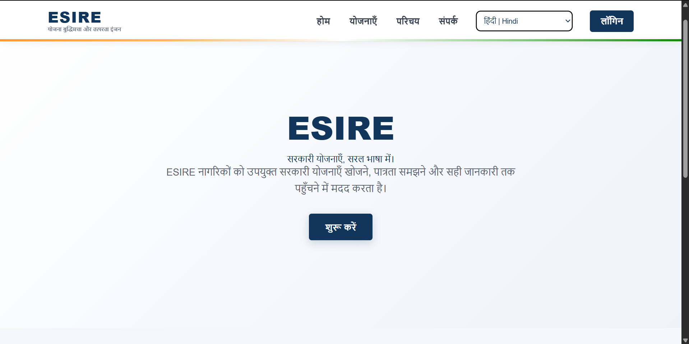
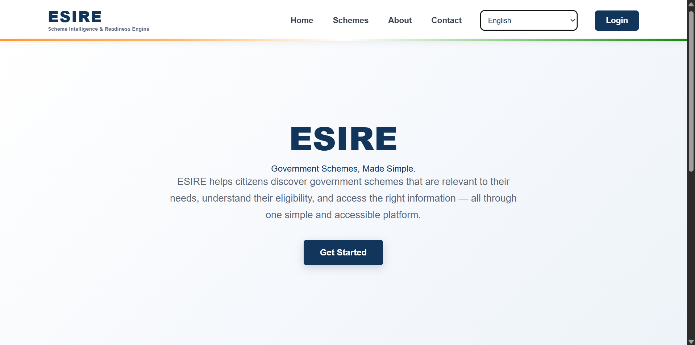
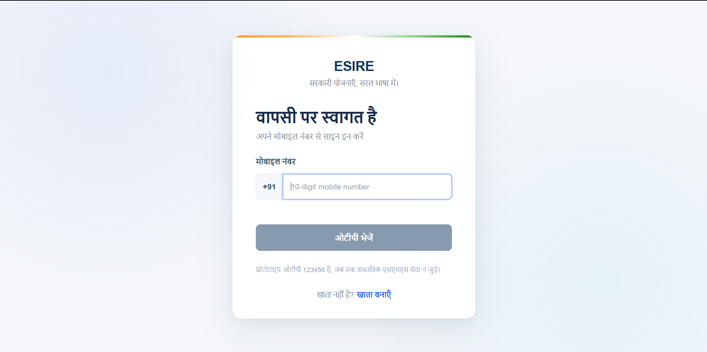
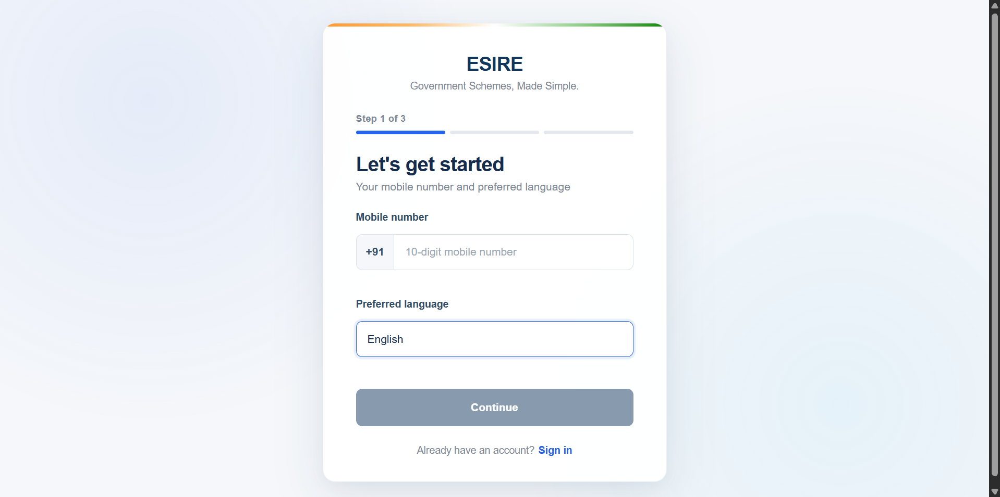
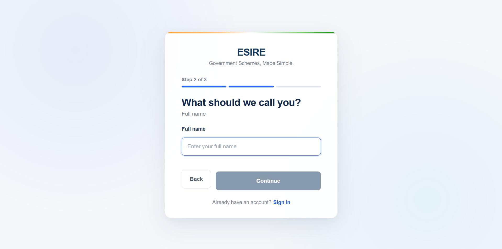
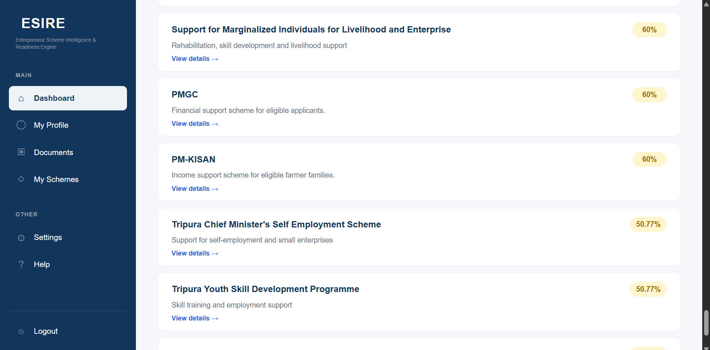
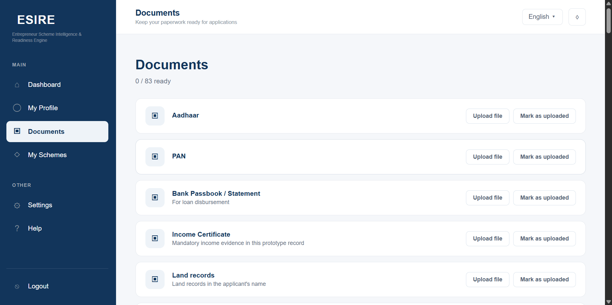
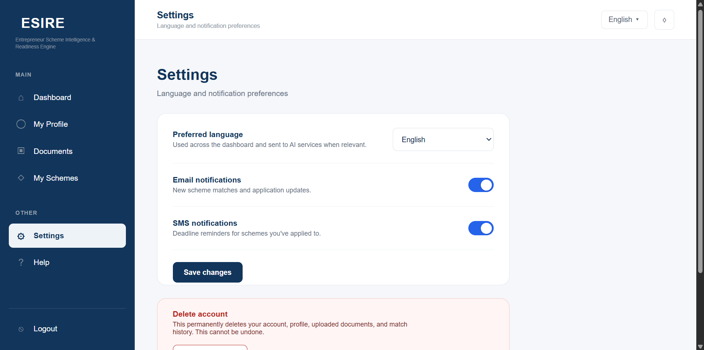

# ESIRE — Eligibility & Scheme Intelligence for Readiness Engine

**ESIRE** is an AI-powered platform designed to help people discover relevant government schemes, understand eligibility requirements, and determine their readiness to apply.

It combines **LLM-based profile understanding, personalized scheme matching, document readiness, multilingual accessibility, knowledge graphs, and rule-based eligibility verification** into a single platform.

> 🚧 **Project Status:** Active Development — Smart India Hackathon (SIH)

---

## 🌟 What is ESIRE?

Finding the right government scheme can be difficult.

Users may have to:

* Search through numerous government schemes
* Understand complicated eligibility requirements
* Determine whether a scheme applies to their situation
* Identify the documents they need
* Deal with language barriers
* Search across multiple sources

**ESIRE aims to simplify this process by bringing scheme discovery, profile analysis, eligibility, and document readiness together in one platform.**

### Core Workflow

```text
                         USER
                           │
                           ▼
                  ┌─────────────────┐
                  │  User Profile   │
                  │  & Requirements │
                  └────────┬────────┘
                           │
                           ▼
                  ┌─────────────────┐
                  │  AI / LLM Layer │
                  │ Profile Analysis│
                  └────────┬────────┘
                           │
                           ▼
                  ┌─────────────────┐
                  │ Scheme Matching │
                  │   & Scoring     │
                  └────────┬────────┘
                           │
                           ▼
                  ┌─────────────────┐
                  │ Eligibility &   │
                  │ Document Check  │
                  └────────┬────────┘
                           │
                           ▼
                  ┌─────────────────┐
                  │ Personalized    │
                  │ Recommendations │
                  └─────────────────┘
```

---

# 🖥️ Prototype

The current prototype includes a complete frontend experience covering authentication, multilingual interaction, profile management, documents, schemes, settings, and the main dashboard.

## 🌐 Multilingual Dashboard

The interface is designed to support multiple languages, with the current prototype demonstrating **English, Hindi, and Manipuri** user-facing experiences.




---

## 🚀 Landing Page

The landing page introduces ESIRE and its purpose of simplifying access to government schemes.



---

# 🔐 Authentication

## Login

Users can securely access their ESIRE account through the login interface.



## Signup

The signup flow guides new users through the account creation process.



### Multi-Step Profile Setup

The registration flow is designed to collect the information required for personalized scheme matching.




---

# 📊 Dashboard

The dashboard provides users with a centralized view of their ESIRE experience, including scheme discovery, profile information, documents, and other platform functionality.


---

# 👤 Profile & AI-Based Understanding

ESIRE is designed to allow users to provide information about themselves in a natural way.

The AI layer can process information such as:

* Personal details
* Income
* Location
* Applicant category
* Occupation
* Business information
* Other eligibility-related attributes

For the prototype, **Ollama** can be used to run local language models.

The extracted information can then be used by the matching and eligibility systems.

---

# 📋 Scheme Discovery

The scheme interface allows users to explore government schemes and identify schemes relevant to their profile.



### Scheme Matching

Candidate schemes can be evaluated using signals such as:

* Profile compatibility
* Eligibility requirements
* Semantic relevance
* Location
* Applicant category
* Business or occupation type
* Required documents

The resulting matching information can help users understand why a scheme may be relevant to them.

---

# 📄 Document Readiness

ESIRE is designed to consider the documents required by individual schemes.

The document system can track:

* Required documents
* Documents already provided
* Missing documents
* Application readiness



This allows users to understand not only **which schemes may be relevant**, but also **what they may still need before applying**.

---

# ⚙️ Settings

Users can manage application preferences and platform settings from a dedicated settings interface.



---

# 🧠 AI & Recommendation System

ESIRE follows a **neuro-symbolic approach**, combining AI-based understanding with deterministic verification.

### LLM Intelligence

The LLM layer is designed to understand:

* User-provided information
* Scheme descriptions
* Eligibility requirements
* Benefits
* Required documents
* Natural-language queries
* Multilingual input

### Scheme Matching

The recommendation system can combine multiple signals to identify potentially relevant schemes.

```text
User Profile
     │
     ├── Age
     ├── Income
     ├── Location
     ├── Category
     ├── Occupation
     └── Documents
            │
            ▼
      Scheme Matching
            │
            ▼
        Relevance
            │
            ▼
   Eligibility Verification
```

### Rule-Based Verification

AI-based matching is intended to be followed by explicit eligibility checks.

Potential conditions include:

* Age
* Income
* Location
* Applicant category
* Business type
* Other scheme-specific requirements

This separates **AI-based recommendation** from **deterministic eligibility verification**.

---

# 🗄️ Data Architecture

Different database technologies are used for different types of information.

### PostgreSQL

Used for structured application data such as:

* Users
* Profiles
* Authentication
* Applications
* Transactional data

### MongoDB

Used where flexible or document-oriented data structures are appropriate.

### Neo4j

Planned for the scheme knowledge graph.

The graph can represent relationships such as:

```text
User
 │
 ├── belongs to ──► Category
 │
 ├── located in ──► State
 │
 └── operates ────► Business Type
                         │
                         ▼
                       Scheme
                         │
              ┌──────────┼──────────┐
              ▼          ▼          ▼
           Benefit    Document   Eligibility
```

This allows schemes, eligibility conditions, documents, and related entities to be represented as connected data.

---

# 🏗️ System Architecture

```text
                         ┌───────────────┐
                         │     User      │
                         └───────┬───────┘
                                 │
                                 ▼
                         ┌───────────────┐
                         │ React + Vite  │
                         │   Frontend    │
                         └───────┬───────┘
                                 │
                                 ▼
                         ┌───────────────┐
                         │    FastAPI    │
                         │    Backend    │
                         └───────┬───────┘
                                 │
               ┌─────────────────┼─────────────────┐
               │                 │                 │
               ▼                 ▼                 ▼
        ┌────────────┐    ┌────────────┐    ┌────────────┐
        │ PostgreSQL │    │  MongoDB   │    │   Neo4j    │
        │ Structured │    │ Flexible   │    │ Knowledge  │
        │    Data    │    │    Data    │    │   Graph    │
        └────────────┘    └────────────┘    └─────┬──────┘
                                                  │
                                                  ▼
                                         ┌────────────────┐
                                         │  AI / Ollama   │
                                         │ Intelligence   │
                                         └───────┬────────┘
                                                 │
                                                 ▼
                                         ┌────────────────┐
                                         │ Matching &     │
                                         │ Scoring Engine │
                                         └───────┬────────┘
                                                 │
                                                 ▼
                                         ┌────────────────┐
                                         │ Rule / Z3      │
                                         │ Verification   │
                                         └───────┬────────┘
                                                 │
                                                 ▼
                                         ┌────────────────┐
                                         │ Recommendations│
                                         └────────────────┘
```

---

# 🛠️ Technology Stack

| Layer            | Technologies                 |
| ---------------- | ---------------------------- |
| Frontend         | React, Vite, JavaScript, CSS |
| Backend          | Python, FastAPI, SQLAlchemy  |
| Database         | PostgreSQL, MongoDB          |
| Knowledge Graph  | Neo4j                        |
| AI               | Ollama, LLMs                 |
| Recommendation   | Profile Matching & Scoring   |
| Verification     | Rule Engine, Z3              |
| Authentication   | JWT                          |
| Containerization | Docker                       |

---

# 📁 Project Structure

```text
ESIRE/
│
├── Backend/
│   ├── app/
│   │   ├── data/
│   │   │   └── seed_schemes.json
│   │   │
│   │   ├── db/
│   │   │   ├── mongo.py
│   │   │   ├── neo4j_db.py
│   │   │   └── postgres.py
│   │   │
│   │   ├── routers/
│   │   │   ├── auth.py
│   │   │   ├── documents.py
│   │   │   ├── schemes.py
│   │   │   ├── system.py
│   │   │   └── users.py
│   │   │
│   │   ├── services/
│   │   │   ├── catalog.py
│   │   │   ├── extractor.py
│   │   │   ├── matching.py
│   │   │   ├── ollama.py
│   │   │   ├── otp.py
│   │   │   ├── scoring.py
│   │   │   └── z3_engine.py
│   │   │
│   │   ├── config.py
│   │   ├── deps.py
│   │   ├── main.py
│   │   ├── models.py
│   │   ├── schemas.py
│   │   └── security.py
│   │
│   ├── tests/
│   ├── requirements.txt
│   └── pytest.ini
│
├── Frontend/
│   ├── public/
│   ├── src/
│   │   ├── Components/
│   │   ├── Pages/
│   │   ├── api/
│   │   ├── auth/
│   │   ├── i18n/
│   │   ├── App.jsx
│   │   └── main.jsx
│   │
│   ├── package.json
│   ├── package-lock.json
│   └── vite.config.js
│
├── images/
│   ├── LandUpPage.png
│   ├── LandUpPageHindi.png
│   ├── LoginPage.png
│   ├── Multilingual Dashboard.png
│   ├── MyDocuments.png
│   ├── Schemes.png
│   ├── Settings.png
│   ├── SignUpPage.png
│   ├── SignUpPage1.png
│   └── SignUpPage2.png
│
├── .env.example
├── .gitignore
├── docker-compose.yml
└── README.md
```

---

# ⚙️ Getting Started

## Prerequisites

Install:

* Node.js
* npm
* Python
* Git
* PostgreSQL
* Docker *(optional)*
* Ollama *(required for local LLM functionality)*

---

## Clone the Repository

```bash
git clone https://github.com/ayushkr0809/ESIRE-SIH-Eligibility-Scheme-Intelligence-for-Readiness-Engine.git

cd ESIRE-SIH-Eligibility-Scheme-Intelligence-for-Readiness-Engine
```

---

## Frontend Setup

```bash
cd Frontend
npm install
npm run dev
```

The Vite development server will normally be available at:

```text
http://localhost:5173
```

---

## Backend Setup

From the project root:

```bash
cd Backend
```

Create a virtual environment:

```bash
python -m venv venv
```

Activate it on Windows:

```powershell
venv\Scripts\activate
```

Install dependencies:

```bash
pip install -r requirements.txt
```

Run FastAPI:

```bash
uvicorn app.main:app --reload
```

The API will normally be available at:

```text
http://127.0.0.1:8000
```

FastAPI documentation:

```text
http://127.0.0.1:8000/docs
```

---

# 🔐 Environment Variables

Sensitive configuration should **never be committed** to the repository.

Examples include:

* Database credentials
* JWT secrets
* Neo4j credentials
* MongoDB credentials
* API keys
* Other private configuration

Use `.env.example` as a template for local configuration.

---

# 🗺️ Roadmap

## Frontend

* [x] Landing page
* [x] Authentication UI
* [x] Dashboard
* [x] Scheme interface
* [x] Profile interface
* [x] Documents interface
* [x] Settings
* [x] Multilingual UI structure
* [ ] Complete backend integration
* [ ] Final UI polish

## Backend

* [x] FastAPI structure
* [x] Authentication structure
* [x] Scheme APIs
* [x] User APIs
* [x] Document APIs
* [x] Matching service structure
* [x] Scoring service structure
* [x] Ollama integration
* [x] Z3 engine structure
* [ ] Complete production database integration
* [ ] Full frontend-backend integration

## AI & Recommendation

* [x] Ollama integration structure
* [x] Matching service structure
* [x] Scoring service structure
* [ ] Complete LLM recommendation pipeline
* [ ] Improved semantic matching
* [ ] Multilingual AI processing

## Knowledge Graph

* [x] Neo4j integration structure
* [ ] Scheme graph construction
* [ ] Entity modelling
* [ ] Relationship modelling
* [ ] Graph-based recommendation queries

## Verification

* [x] Rule engine structure
* [x] Z3 integration structure
* [ ] Complete eligibility rule modelling
* [ ] Explainable verification results
* [ ] Document-aware eligibility verification

## Deployment

* [x] Docker configuration
* [ ] Production configuration
* [ ] Cloud deployment
* [ ] Monitoring and logging

---

# 🎯 Project Goal

ESIRE aims to make government schemes **easier to discover, understand, and prepare for**.

The platform brings together:

```text
AI Intelligence
       +
Scheme Matching
       +
Knowledge Graphs
       +
Document Readiness
       +
Deterministic Verification
       +
Multilingual Accessibility
```

into a single platform designed around the user's profile and requirements.

---

# 👥 Team

ESIRE is being developed collaboratively as part of the **Smart India Hackathon (SIH)**.

Team members and contributors will be documented as the project progresses.

---

## 📌 Status

**ESIRE is currently under active development for Smart India Hackathon (SIH).**

The project is evolving from a functional frontend prototype into an integrated platform combining:

**React + FastAPI + PostgreSQL + MongoDB + Neo4j + Ollama + Rule-Based Verification**

with the goal of creating a personalized and accessible government scheme discovery experience.
